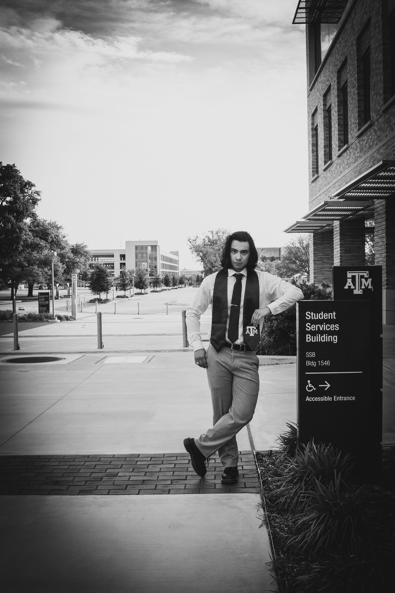

I was born in San Juan, Puerto Rico, but moved to Dallas, Texas when I was four years old. I did K-12 and earned my bachelors degree in Texas. I love to travel and meet new people so feel free to contact me for any questions you may have for me. 

# Education

Attended Texas A&M University from 2018 to 2022 and obtained a degree in Oceanography from the College of Geoscience. 

```{r, out.width="33%", echo=FALSE}

```

I am currently attending graduate school at University of Puerto Rico at Mayaguez in the department of Marine Science for a masters thesis degree in chemical oceanography under the Biochemistry and Ecology Research lab group under Dr. Travis Courtney which you can find more details on [here](https://theberglab.com/).


## My blog

If you want to visit my science activist blog, go [there](https://github.com/privefl/jekyll-now-r-template).

## Conclusion

Combating climate change is a vital issue that affects people of any race, socio-economic status, religion, creed, gender or no gender, age, nationality, or any other label because this is a global problem. It us to all of us (as a species) to take accountability for our actions against the planet and other species inhabiting this Earth for the future of humanity to enjoy a healthy and plentiful Earth.

### If you want to make your own website try this 

- There's additional information for creating GitHub pages directly from [Github](https://pages.github.com/)

- Make sure that you have enabled Git in RStudio. More information can be found [there](https://privefl.github.io/advr38book/good-practices.html#git).

- You need a GitHub account.